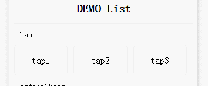

# react-tap-event
react tap组件，支持onTap事件以及点击态,同时增加了ios惯性滚动点停的功能。




# install

```shell
    npm install react-tap-event
```

# usage

```js
import React, { PropTypes } from 'react'
require('./TapDemo.less');
require('react-tap-event');

class TapDemo extends React.Component {
onTap(index) {
    alert(index);
}
render () {
    return (
        <div>
            <div className="demo-title">Tap</div>
            <div className="tap-container">
                <div className="tap button" onTap={()=>this.onTap(1)} tapActive={true}>tap1</div>
                <div className="tap button" onTap={()=>this.onTap(2)} tapActive={'tap-ripple'}>tap2</div>
                <div className="tap button" onTap={()=>this.onTap(3)} tapActive={'green'}>tap3</div>
            </div>
        </div>
    )
}
}

export default TapDemo;

```

# docs
**onTap**

> 与onClick事件一样的使用方式，只在基础的html标签上生效

**tapActive**

>  true: 开启默认点击态   background-color:rgba(0,0,0,.1)

> String: 自定义className，个性化点击态
